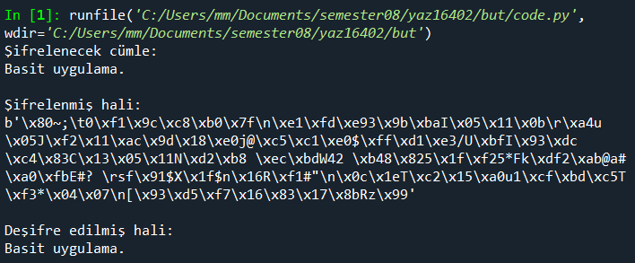

# RSA_simple_app
## YAZ16402 Yazılım Güvenliği Dersi Final Ödevi

### Geliştirici
1180505612 - Mekan Myradov

### Giriş
Teknolojinin gelişmesiyle birlikte veri akışının hızı da artmıştır. Bu artış birçok avantajın yanında önemli miktarda riskler de oluşturmuştur. A noktasından B noktasına giderken verilerin bütünlüğünün bozulması veya yetkisiz kişiler tarafından ele geçirilmesi bu risklere örnek olarak verilebilir. Bu tür risklerden kaçınmak için son 50 yılda çeşitli veri şifreleme algoritmaları geliştirilmiştir. Bu çalışmada asimetrik bir şifreleme algoritması olan RSA'dan bahsedilmiştir ve bu algoritma ile bir mesajı şifreleyen ve deşifre eden basit bir uygulamaya yer verilmiştir.

### Asimetrik Şifreleme Algoritmaları ve RSA
Asimetrik şifreleme algoritmaları, verileri şifrelemek ve şifresini çözmek için bir açık anahtar (public key) ve bir özel anahtar (private key) olmak üzere iki anahtar gerektirir. Bu tür algoritmalar kullanıldığında, açık anahtarla şifrelenen verilerin şifresi özel anahtarla çözülebilir. Günümüzde en yaygın olarak kullanılan asimetrik şifreleme algoritması RSA algoritmasıdır.
RSA, 1977'de üç bilim adamı, Ron Rivest, Adi Shamir ve Leonard Adleman tarafından geliştirilmiştir [1]. Algoritmanın adı, algoritmayı geliştiren kişiler tarafından yazılan bilimsel makaledeki soyadlarının ilk harflerinin birleşiminden gelmektedir [2].
RSA algoritması veriyi aşağıdaki formülü kullanarak şifrelemektedir. Bu formülde P veri, C verinin şifrelenmiş hali, e açık anahtar, d özel anahtar ve n iki büyük asal sayının çarpımıdır [3].
C= P^e mod n
RSA, şifrelenen veriyi deşifre etmek için ise bu formülü kullanmaktadır:
P= C^d  mod n

### Uygulamanın Demosu
Uygulama çalıştırıldığından sonra çıkan sonucu altta görebilirsiniz:

